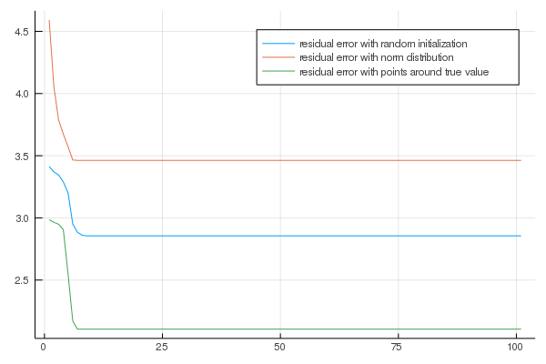
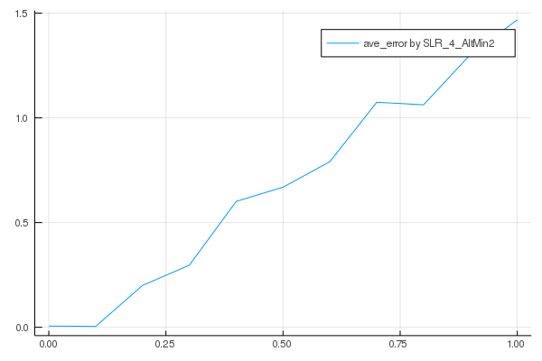
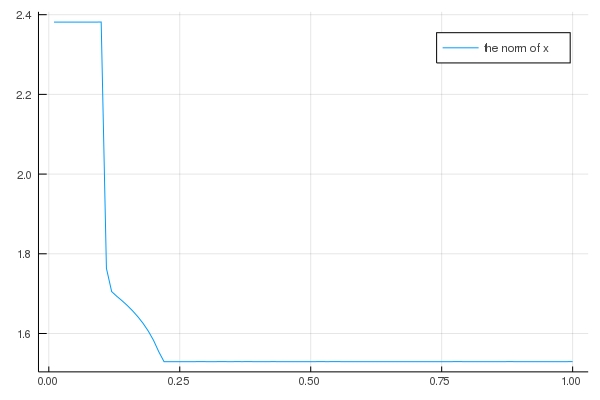
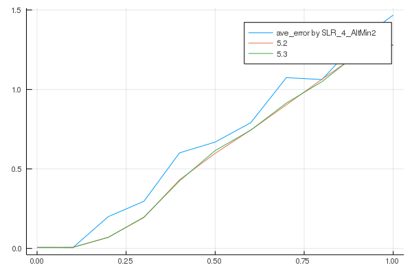

<script type="text/javascript" src="http://cdn.mathjax.org/mathjax/latest/MathJax.js?config=TeX-AMS-MML_HTMLorMML"></script>
<script type="text/x-mathjax-config">
    MathJax.Hub.Config({ tex2jax: {inlineMath: [['$', '$']]}, messageStyle: "none" });
</script>
# Homework: Linear Regression without Correspondences
Wu Fan(2019233180)

## 1 Appetizer

* Exercise 1.1 implement the function SLR 1 gen data


```julia
#using Distributions
using LinearAlgebra
using Random
"""
generating data:
m, n: the dimensions of the data
sigma: the standard deviation of noise
shuffled ratio: how many percentages of the rows of A, or equivalently the entries of y. should be shuffled.
The m × n matrix A and the parameter x ∈ Rn are randomly sampled from the standard normal distribution.
"""
function SLR_1_gen_data(m, n, sigma,shuffled_ratio )
    A=randn(m,n)
    x=randn(n,1)
    P=Matrix{Float64}(I, m, m)
    B=copy(A)
    noise=sigma*randn(m,1)
    if shuffled_ratio==0
       B=P*B
    else
       s=trunc(Int,m*shuffled_ratio)
       index=randperm(m)[1:s]
       index1=shuffle(index)
       B[index,:]=B[index1,:]
    end
    y=B*x+noise
    
    return A,x,y#,B
end
```


    SLR_1_gen_data


* Exercise 1.2  
Proof   
    1.first we sort the y in a ascend(descend) order by a complexity O(m × log m) sort algorithm, and rerange the matrix A in the Corresponding order  
    2.then the optimal solution should be the index of Pi make y1=A(rerange)x in the ascend(descend) order  
    3.if there exist another index of $\Pi$ make the $||y-\Pi Ax||_2$ minimal with y2=A(rerange)x not in a ascending(descending) order  
    4.for the easy case we switch the $y_1[i]$ and $y_1[j]$ to get a new solution(i<j)  
    $y_1[i]$<$y_1[j]$ and $y_2[i]$>$y_2[j]$   
    5.with $y[i]$<$y[j]$, we can easily see that $(y[i]-y_1[i])^2+(y[j]-y_1[j])^2<(y[i]-y_2[i])^2+(y[j]-y_2[j])^2$    
    6.so $||y-y_2||_2$ is bigger than $||y-y_1||_2$  
 when the observable vector y has no same entry.  the solution of (1.3) is unique. 


```julia
function SLR_1_Pi_given_x(A, y, x)
"""
find the optimal permutation Πx for the problem O(m × log m)
function [Pi_idx] = SLR_1_Pi_given_x(A, y, x)
% Pi_idx is a m-dimensional vector such that Pi*A = A(Pi_idx, :)

Pi_idx = zeros(m, 1);
end
"""
    y_sorted=sort(y,dims=1)#mlogm
    index_y=sortperm(y[:,1])
    index_Ax=sortperm((A*x)[:,1])
    Pi_idx=sortperm(index_y)
    Pi_idx=index_Ax[Pi_idx,:]
    x_=A[Pi_idx[:,1],:]*x-y
    error=norm(x_)
return Pi_idx,error
end   
```


    SLR_1_Pi_given_x (generic function with 1 method)


```julia
#test with noise 
#B is the shuffled matrix of A, which means Pi*A=B
A,x,y=SLR_1_gen_data(7, 3, 0.01,0.3 )
Pi_idx,error=SLR_1_Pi_given_x(A, y, x)
```


    ([1; 2; … ; 6; 7], 0.027949614809862598)


```julia
#test without noise 
#B is the shuffled matrix of A, which means Pi*A=B
A,x,y=SLR_1_gen_data(7, 3, 0.0,0.3 )
Pi_idx,error=SLR_1_Pi_given_x(A, y, x)
```


    ([1; 2; … ; 6; 7], 0.0)


## 2 Brute Force

*   Exercise 2.1  least-square solver  
generate data A, y without shuffling,
How large sigma can be for least-squares to have small errors (≤ 1%)  
\begin{gather}
errors=100\%*\frac{||x-\hat{x}||_2}{||x||_2}\\\\
     y=Ax+\epsilon \\\\
     \hat{x}=(A^TA)^{-1}A^Ty \\\\
     error=\frac{||x-(A^TA)^{-1} A^T(Ax+\epsilon)||_2}{||x||_2}=\frac{\sigma||\xi||_2}{||x||_2}
\end{gather}
     To have small errors $(\leqslant1\%)$, $\xi$, x is both produced by norm distribution 
, we should set the magnitude of sigma equals 0.01. the code following can also show this.


```julia
#SLR 2 brute force run.jl
for m in 4:8
    sigma=0
    result=[]
    Error=0
    while Error < 0.01
        A,x,y=SLR_1_gen_data(m, 3, sigma, 0)
        #least-square solver 
        x_hat=inv(A'*A)*(A'*y)
        Error=norm(x-x_hat)/norm(x)
        push!(result,Error)
        sigma+=0.01
    end
    #println((sigma-0.01), result[end-1])
    #println((sigma), result[end])
end
```

| m   |  max_sigma |  error|  max_sigma+0.01 |  next_error|
|---|:----:|:-------:|:------:|:------:|
| 4 | 0.02 | 1.64e-16|0.03|0.175 |
| 5 | 0.02 | 0.00978 |0.03|0.103|
| 6 | 0.01 | 0.00978 |0.02|0.249|
| 7 | 0.03 | 1.19e-16|0.04|0.38|
| 8 | 0.02 | 0.00438 |0.03|0.15|

* Exercise 2.2 implementation  SLR 2 brute force.jl


```julia
using Combinatorics
function SLR_2_brute_force(A,y)
    """
    store the x_hat and Pi in the brute_result(dict)
    """
    m,n=size(A)
    #compute all permutations of n rows of A
    indexs=collect(permutations(1:m,m)) #outout is A_m^n
    #brute_result=Dict{Array,Array}()
    min_error=0.5
    x_f=zeros(n,1)
    pi_index=zeros(m,1)
    for index in indexs 
        As=A[index,:]
        x_hat=inv(As'*As)*(As'*y)
        #compare Least squares residual
        error=norm(y-As*x_hat)
        if min_error>error
            min_error=error
            x_f=x_hat
            pi_index=index
        end
    end
    return pi_index,min_error,x_f
end
```


    SLR_2_brute_force (generic function with 1 method)


* Exercise 2.2 How large m, n can go for this algorithm to be efficient (terminates in less than half an hour)  
Processor :	Quad-Core Intel Core i5 2.3 GHz


```julia
m=10#9,8,7,6,5,4,3
Error=0
t=0
while t<=1.5*60*60
    t1=time()
    A,x,y=SLR_1_gen_data(m, 10, 0.01,0.3)
    pi_index,min_error,x_f=SLR_2_brute_force(A,y)
    e=norm(x-x_f)/norm(x)
    t2=time()
    t=t2-t1
    println(e)#see the error goes
    println(t)
    println(m)
    m+=1
end
print(m)#maximize m
```

| max_m   |  n |
|----|:----:|
|11|3|
|11|4|
|11|5|
|10|6|
|10|7|
|10|8|
|10|9(error:0.13)|

Exercise 2.2 How large sigma can be for this algorithm to have small errors (≤ 1%)


```julia
for m in 4:8
    sigma=0.0
    min_error=0
    while min_error<0.01
        A,x,y=SLR_1_gen_data(m, 3, sigma, 0.3)
        #brute_result=SLR_2_brute_force(A,y)
        #Error=[]
        #for x_hat in collect(values(brute_result))
        #    error = norm(x_hat - x) / norm(x)
        #    push!(Error,error)
        #    min_error=minimum(Error)  
        #end
        pi_index,residual_error,x_f=SLR_2_brute_force(A,y)
        min_error = norm(x_f - x) / norm(x)
        sigma+=0.01
    end
    println(m, (sigma), min_error)
end
```

    40.030.09634418171542888
    50.050.044053965219168635
    60.040.15016163400459318
    70.030.013008559136774638
    80.030.02301043506369592


| m   |  max_sigma |  max_sigma+0.01 |  next_error|
|---|:----:|:------:|:------:|
| 4 | 0.02 |0.03|0.0963 |
| 5 | 0.04 |0.05|0.0441|
| 6 | 0.03 |0.04|0.150|
| 7 | 0.02 |0.03|0.013|
| 8 | 0.02 |0.03|0.023|

* Exercise 2.2 How many percentages of shuffled data can the algorithm tolerate 
consider both time and error  
Almost can recovery with 100% and small running time when m=9,n=3 case


```julia
for m in 4:10
    shuffle_rate=0
    min_error=0
    while min_error < 0.01
        A,x,y=SLR_1_gen_data(m, 3, 0.01, shuffle_rate)
        #brute_result=SLR_2_brute_force(A,y)
        #Error=[]
        #for x_hat in collect(values(brute_result))
        #   error = norm(x_hat - x) / norm(x)
        #    push!(Error,error)
        #    min_error=minimum(Error)  
        #end
        pi_index,residual_error,x_f=SLR_2_brute_force(A,y)
        min_error = norm(x_f - x) / norm(x)
        shuffle_rate+=0.1
        if shuffle_rate>1
            break
        end
    end
    println(m, shuffle_rate, min_error)
end
```

    40.10.011496730717910913
    50.300000000000000040.013414348358015356
    60.10.010457453479885793
    70.50.017209886839444296
    80.20.02400701807170804
    91.09999999999999990.005122594344178337


| m   |  max_shuffle_rate |  max_shuffle_rate+0.1 |  next_error|
|---|:----:|:------:|:------:|
| 4 | 0.0 |0.1|0.011 |
| 5 | 0.2 |0.3|0.013|
| 6 | 0.0 |0.1|0.0104|
| 7 | 0.4 |0.5|0.0172|
| 8 | 0.1 |0.2|0.024|
| 9 |  1.0|1.0|0.005|
| 10 | time|is |too long|


## Exercise 3.1 (RANSAC)  
* Implement the RANSAC algorithm in  SLR 3 RANSAC.jl


```julia
using Combinatorics
function SLR_3_RANSAC(A, y)
   # x: the final estimate
   # view the shuffled rows is outlier
    m,n=size(A)
    #m，n的排列数
    #run many times to get the average
    indexs=collect(permutations(1:m,n))
    yError=1.0
    xf=zeros(n,1)
    ys=rand(y,n)
    for index in indexs
        As=A[index,:]
        x_hat=inv(As'*As)*(As'*ys)
        pi_index,error = SLR_1_Pi_given_x(A, y, x_hat)
            #find the min_error respect to one subvector
        if yError>error
            yError=error
            xf=x_hat
        end
    end
    pi_index,error= SLR_1_Pi_given_x(A, y, xf)
    return pi_index,error,xf
end
```


    SLR_3_RANSAC (generic function with 1 method)


```julia
A,x,y=SLR_1_gen_data(20, 3, 0.0,0.3)
```


    ([-1.76113 -0.631543 -1.22846; -0.305494 0.944392 1.28139; … ; 0.00405066 2.42875 -1.06157; -0.245887 0.598749 1.78745], [0.368825; 0.651924; 0.969982], [-2.25285; -1.6977; … ; 0.555146; 2.03344])


```julia
#test error with sigma=0
SLR_3_RANSAC(A, y)
```


    ([1; 7; … ; 19; 20], 7.170483212558056e-15)


* Exercise 3.1 the maximal values of n corresponding to the above m,so that the algorithm remains efficient (terminates in less than half an hour)

* Exercise 3.1   
Describe this algorithm in the language of RANSAC that you learned from one of the previous lectures.   
1.Select every selected n rows of the measure matrix A. Call this matrix set the hypothetical right solution.  
2.A linear least square model is fitted to the selectrd matrix A set and a random select subvector y, get a set of $\hat{x}$  
3.for every $\hat{x}$ in the set computed by the last step, compute the error with the whole y.   
4.select the minimal error and $\hat{x}$  
5.compute the $\Pi$ by SLR\_1\_Pi\_given\_x.jl   
    
What is the time complexity of this RANSAC algorithm?    
the time complexity of this RANSAC algorithm is $O((N^3 + N^2)M^N)$


```julia
n=4
#for m in 20:20:200
    t=0.0
    while t<=1.5*60*60
        t1=time()
        A,x,y=SLR_1_gen_data(40, n, 0.01,0.3)
        pi_index,error=SLR_3_RANSAC(A, y)
        t2=time()
        t=t2-t1
        #println(t)
        n+=1
        println(m,n,pi_index,error)
    end
    #println(m,n)
#end
```

|  m|  max_n|
|---|:----:|
| 20 | 6 |
| 40 | 5 |
| 60 | 4|
| 80 | 4|
| 100 | 4|
| 120 | 4|
| 140 | 4|
| 160 | 3|
| 180 | 3|
| 200 | 3|


* Exercise 3.1 Run the algorithms and compare Brute Force and RANSAC with errors averaged over 100 trials  
Answer:you can see in the result following, obvious the error of Brute Force can always in a low order, because in the small m,n case Brute Force can go through all case, but RANSAC perfomance rely on the iterations and the random selected subvector, error is terriblely big.    
if the m,n is very big(normal case),Brute Force can't run


```julia
#compare Brute Force and RANSAC with errors averaged over 100 trials
#A,x,y=SLR_1_gen_data(7, 3, 0.01,0.3)
E_ransac=[]
E_brute_force=[]
for i in 1:100
    A,x,y=SLR_1_gen_data(7, 3, 0.01,0.3)
    pi_index1,error,xf=SLR_3_RANSAC(A, y)
    error1=norm(x-xf)/norm(x)
    push!(E_ransac,error1)
    pi_index2,error,x_f=SLR_2_brute_force(A,y)
    error2=norm(x-x_f)/norm(x)
    push!(E_brute_force,error2)
end
e1=sum(E_ransac)/100
e2=sum(E_brute_force)/100
print(e1,e2)#0.8735802239094776 0.018882414427911255
E_ransac
```

    0.313479279503713350.0074439080122472735


    100-element Array{Any,1}:
     0.0029189705892626954
     0.8623320028869552   
     1.0                  
     0.05270090103478715  
     2.2942601017379047   
     2.1051804037419046   
     0.01007513472195127  
     1.1941294078181446   
     0.0052376732770581386
     0.05623592150891767  
     1.0                  
     0.007038051043853742 
     1.0                  
     ⋮                    
     1.0                  
     0.005653884406168448 
     0.007342768074817725 
     1.9485125256032532   
     0.004985095827432906 
     0.08467413896320783  
     1.0                  
     1.0                  
     0.028667912307279816 
     0.522706390094279    
     1.0                  
     0.011240058208619414 


* Exercise 3.2   
Question:If we want the algorithm to find the groundtruth parameter x with probability γ, then how many iterations should we at least run?  
Answer：The problem can be equaled to pick one right $\Pi$ from a alternating set without replacement. $A_{m}^{n}$ is the permutating number ,so at the kth select, we havn't get the right $\Pi$ with a probability$\frac{A_{m}^{n}-1}{A_{m}^{n}}\frac{A_{m}^{n}-2}{A_{m}^{n}-1}...\frac{A_{m}^{n}-k}{A_{m}^{n}-k-1}=\frac{A_{m}^{n}-k}{A_{m}^{n}}$,which means $1-\gamma=\frac{A_{m}^{n}-k}{A_{m}^{n}}$,so $\gamma=1-\frac{A_{m}^{n}-k}{A_{m}^{n}}$, so $k=\gamma A_{m}^{n}$. you can view this as a Expectation with regard to $\gamma$。

## 4 Alternating Minimization

* Exercise 4.1 (Alternating Minimization)Put respectively the algorithm implementation in SLR 4 AltMin.jl


```julia
#using Distributions
using LinearAlgebra
function SLR_4_AltMin(A, y, x0, num_iter)
"""% x0: the initialization
% num_iter: the number of iterations the algorithm run
%           set it to be large enough if not sure, 100 is a typical choice.
% x_hat: the final estimate
% e_hat: the objective function value

x_hat = 0;
e_hat = 0;
    end"""
    x_hat=x0
    i=0
    E_hat=[]
    while i<=num_iter
        pi_index,_=SLR_1_Pi_given_x(A, y, x_hat)
        As=A[pi_index[:,1],:]
        x_ls=inv(As'*As)*(As'*y)
        e_hat=norm(As*x_ls-y)
        push!(E_hat,e_hat)
        x_hat=x_ls
        i=i+1
        #println(xi)
    end
    return x_hat,E_hat
end
```


    SLR_4_AltMin (generic function with 1 method)


```julia
using Plots
```


```julia
#a decreasing curve as the iteration goes.
A,x,y=SLR_1_gen_data(30, 4, 0.01,0.3 )
m,n=size(A)
x0=rand(n,1)
x01=randn(n,1)
x02=x+randn(n,1)
x_hat,E_hat=SLR_4_AltMin(A, y, x0, 100)
x_hat1,E_hat1=SLR_4_AltMin(A, y, x01, 100)
x_hat2,E_hat2=SLR_4_AltMin(A, y, x02, 100)
i =1: length(E_hat)
plot(i,E_hat[i],label="residual error with random initialization",fmt = :png)
plot!(i,E_hat1[i],label="residual error with norm distribution",fmt = :png)
plot!(i,E_hat2[i],label="residual error with points around true value",fmt = :png)
    
```





* Prove that for random initialization the objective function (4.1) decreases in each iteration.  
$$||\vec{y}-\Pi^{(t)}A\vec{x}^{(t)}||_2$$ 

$$\vec{y}=\Pi^{(t)}A\vec{x}+\vec{\epsilon} 
=||\Pi^{(*)}A\vec{x}^{(*)}+\vec{\epsilon}-\Pi^{(t)}A\vec{x}^{(t)}||_2$$  
$$=||\Pi^{(*)}A\vec{x}^{(*)}-\Pi^{(t)}A(\vec{x}^{(t)}-\vec{x}^{(*)})-\Pi^{(t)}A\vec{x}^{(*)})||_2+||\vec{\epsilon}||_2$$

$$=||(\Pi^{(*)}-\Pi^{(t)})A\vec{x}^{(*)}+\Pi^{(t)}A(\vec{x}^{(*)}-\vec{x}^{(t)})||_2+||\vec{\epsilon}||_2$$

we update $\vec{x}^{(t)}$ first, by minmize the $||\Pi^{(t)}A(\vec{x}^{(*)}-\vec{x}^{(t)})||_2$, we get the $\vec{x}^{(t+1)}$,  
then use this $\vec{x}^{(t+1)}$ as $\vec{x}^{(*)}$, we minnize $||(\Pi^{(*)}-\Pi^{(t)})A\vec{x}^{(*)}||_2$ , we get the \Pi^{(t+1)}  
so you can see the objective function is always the minmixal value, so the objective function (4.1) decreases in each iteration

* Instead of running fixed number of iterations before termination, which is ad- hoc, or terminating until it converges, which is equivocal, propose and imple- ment a meaningful termination criterion for this algorithm.  
 a meaningful termination criterion for this algorithm.  
 when $||x^{(k+1)}-x^{(k)}||_2$<eps(given), we stop ,code is following


```julia
using Distributions
using LinearAlgebra
function SLR_4_AltMin2(A, y, x0, eps)
    x_hat=x0
    delt=1.0
    while delt>eps
        pi_index,_=SLR_1_Pi_given_x(A, y, x_hat)
        As=A[pi_index[:,1],:]
        x_ls=inv(As'*As)*(As'*y)
        e_hat=norm(As*x_ls-y)
        push!(E_hat,e_hat)
        delt=norm(x_hat-x_ls)
        x_hat=x_ls
    end
    return x_hat,E_hat
end
```


    SLR_4_AltMin2 (generic function with 1 method)


* Using as initialization the least-square solution of (2.1), run the algorithms, plot the errors  as a function of shuffled ratio (100 averages)


```julia
Error_ave=[]
for shuffle_rate in 0:0.1:1
    Error=[]
    for i in 1:100
        A,x,y=SLR_1_gen_data(10, 4, 0.01,shuffle_rate )
        m,n=size(A)
        x0=inv(A'*A)*(A'*y)
        eps=1e-10
        x_hat,E_hat=SLR_4_AltMin2(A, y, x0, eps)
        error=norm(x_hat-x)/norm(x)
        push!(Error,error)
    end
    error_ave=sum(Error)/100
    #println(shuffle_rate,error_ave)
    push!(Error_ave,error_ave)
end
i=1:length(Error_ave)
shuffle_rate = 0:0.1:1
plot(shuffle_rate,Error_ave[i],label="ave_error by SLR_4_AltMin2",fmt = :png)
```





* Exercise 4.2 (Expectation Maximization).Describe this alter- nating minimization algorithm in the language of Expectation Maximization (EM).

General EM  
x:unobservable varible  
z:Latent varible   
y=f(x)+noise
(x,z are all vector varible,if z is a continus random varible, change $\sum_{z}$ to $\int_{z}...dz$)   

$$argmax_{\theta}logP(\vec{x}|\theta)=logP(\vec{z},\vec{x}|\theta)-logP(\vec{z}|\vec{x},\theta)=log\frac{P(\vec{z},\vec{x}|\theta)}{q(\vec{z})}-log\frac{P(\vec{z}|\vec{x},\theta)}{q(\vec{z})}$$

$$logP(\vec{x})=\sum_{z}q(\vec{z})logP(\vec{x})=\sum_{z}q(\vec{z})log\frac{P(\vec{z},\vec{x}|\theta)}{q(\vec{z})}-\sum_{z}q(\vec{z})log\frac{P(\vec{z}|\vec{x},\theta)}{q(\vec{z})}$$

$$logP(\vec{x}|\theta)=log\frac{P(\vec{z},\vec{x}|\theta)}{q(\vec{z})}-log\frac{P(\vec{z}|\vec{x},\theta)}{q(\vec{z})}   
ELBO=\sum_{z}q(\vec{z})log\frac{P(\vec{z},\vec{x}|\theta)}{q(\vec{z})}$$

$$KL(q(\vec{z})||P(\vec{z}|\vec{x},\theta))=\sum_{z}q(\vec{z})log\frac{P(\vec{z}|\vec{x},\theta)}{q(\vec{z})}$$

$$whole step :\theta^{t+1}=\underbrace{argmax}_{\theta^{t+1}} \sum_{Z} log P(x,z|\theta)P(z|x,\theta^{t})$$

E-step: Evaluate $P(z|x,\theta^{t})$, to get  $q(\vec{z})=P(\vec{z}|\vec{x},\theta)$,so that KL=0   
M-step:$\underbrace{argmax}_{\theta^{t+1}} \sum_{Z}logP(z|x,\theta^{t})P(x,z|\theta^{t+1})$ ,maximize  ELBO


* the Altmin is equal to EM, we assume the $\Pi$ is the latent varible z
the whole EM can be described as:   $\Pi^{t+1}=\underbrace{argmax}_{\Pi^{t+1}} P(\Pi^{t+1}|A,y,x^{t})$  
M_step: get the solution of OLS,$$(A^TA)^{-1}*A^T*\Pi^T*y$$ 
when get the best $\Pi^{(t)}$ from last step the least square step is equal to a MLE process to get the new $x^{(t+1)}$

$$\vec{y}=\Pi^{(t)}A\vec{x}+\vec{\epsilon} $$
$$\left[ \begin{matrix} y_1 \\ y_2 \\ ... \\ y_m \end{matrix} \right]=\left[ \begin{matrix} a_1^T \\ a_2^T \\ ... \\ a_m^T \end{matrix} \right]\vec{x},\Pi^{(t)}A=\left[ \begin{matrix} a_1^T \\ a_2^T \\ ... \\ a_m^T \end{matrix}\right]$$ 

$$\underbrace{argmax}_{{x^{(t+1)}}} log P(\vec{y}|\vec{x})$$


$$log P(\vec{y}|\vec{x})=\sum_{i=1}^{m}P(y_i|\vec{x})=-\frac{m}{2}log2\pi\sigma^2-\sum_{i=1}^{m}-\frac{(y_i-\vec{a_i}^T\vec{x})^2}{2\sigma^2}$$

$$\underbrace{argmax}_{{x^{(t+1)}}}log P(\vec{y}|\vec{x})=\underbrace{argmin}_{{x^{(t+1)}}}log \sum_{i=1}^{m}-\frac{(y_i-\vec{a_i}^T\vec{x})^2}{2\sigma^2}$$


$$\underbrace{argmin}_{{x^{(t+1)}}} \frac{1}{2\sigma^2}||\vec{y}-\Pi^{(t)}A\vec{x}||_2^2$$

E-step: $\Pi^{t+1}$ is the permutation that re-orders y according to the order of $A*x^{t}$.   
estimate $logP(\vec{y}|\vec{x},\Pi),\Pi$ with the $x^{t+1}$ ,to make $$KL(q(\Pi)||p(\Pi|x^{t+1})=0$$   
In this case ,the distribution of $\Pi$ can define by the real case,KL is a distance between distribution,we can define another kind distance of two permutation matrix $Pi^{k+1}$ and $Pi^{k}$ at this step ,just mean that we compute the optimal $Pi^*$ at the step k+1 according to the $x^{t+1}$ 

# 5 Robust Regression

* Exercise 5.1 (robust regression).describe a brute force solution to the l0 norm minimization problem,and explain (not prove) why it makes sense to minimize (5.1) for partially shuffled data 
a brute force solution:   
select all subvector $y_d(R^n)$ of y, and the related rows of $A_{dxd}$. and solve the equation $y_d=A_{dxd}x_{hat}$, get the feasible  set of all $x_{hat}$  
compare all the sum(sign($Ax_{hat}-y$)),select the smallest one as the optimal   
there are set of all possible permute matrix,you can treat permuted data as outliers by using robust regression formulations to estimate the regression parameter , if outliers/outliers+inliers>n/m, it's impossble to find n equations satisfy $a_i^Tx=0$ to get the x

* Using CVX, solve the problems


```julia
using Convex
using SCS
A,x,y= SLR_1_gen_data(10, 4, 0.0,0.3 )
m,n=size(A)
x1 = Variable(n)
solver = SCSSolver(verbose=0)
p1= minimize(norm(A*x1-y,1))
solve!(p1, solver)
```


```julia
x1.value
```


    4×1 Array{Float64,2}:
      1.2069352521807488 
      0.549912172957143  
     -1.1930431115716382 
     -0.07884643347479231


```julia
x2 = Variable(m+n)
solver = SCSSolver(verbose=0)
l=0.1
p2=minimize(norm(y-A*x2[1:n]-sqrt(m)*x2[n+1:m+n],2)/m+l*norm(x2[n+1:m+n],1))
solve!(p2, solver)
```

    [0.855887; 0.412425; 1.43211; 0.637106]


```julia
x2.value[1:n]
```


    4-element Array{Float64,1}:
     0.8558864677727053 
     0.41242536140934155
     1.4321071995548562 
     0.6371054827514245 


* test whether solution is  sensitive to λ
solution is  sensitive to λ


```julia
#big m 
A,x_,y= SLR_1_gen_data(15, 4, 0.0,0.3 )
m,n=size(A)
solution=[]
x = Variable(m+n)
for l in 0.01:0.01:1
    p2=minimize(norm(y-A*x[1:n]-sqrt(m)*x[n+1:m+n],2)/m+l*norm(x[n+1:m+n],1))
    solve!(p2, solver)
    #println(l,x.value[1:n])
    push!(solution,norm(x.value[1:n]))
end
i=1:length(solution)
l = 0.01:0.01:1
plot(l,solution[i],label="the norm of x ",fmt = :png)

```





* Describe the relation  
(5.2) is obtained from (5.3) in the limit λ → 0 and the additional constraint y = Ax + sqrt(m)e. In that sense, (5.2) can be seen as the counterpart to (5.3) in a noiseless setup.

* Experimentally verify that the algorithms are scalable by setting m and/or n large enough, e.g., can they run for m = 10000? 50000?  
10000 is too big for (5.2),it will get wrong solution. (5.3) is working normal with m=10000,
(5.3) can work with m=50000, with error about 0.3


```julia
A,x,y= SLR_1_gen_data(10000, 5, 0.01,0.3 )
m,n=size(A)
x1 = Variable(n)
solver = SCSSolver(verbose=0)
p1= minimize(norm(A*x1-y,1))
solve!(p1, solver)

```

    ┌ Warning: Problem status UnknownError; solution may be inaccurate.
    └ @ Convex /Users/martinawu/.julia/packages/Convex/81M4N/src/solution.jl:48


```julia
x1.value
```


    5×1 Array{Float64,2}:
     -0.3607171967920287 
     -1.5389834805079545 
      0.8708969029125028 
      0.22769747046606195
      0.6532348296947064 


```julia
x2 = Variable(m+n)
solver = SCSSolver(verbose=0)
l=0.1
p2=minimize(norm(y-A*x2[1:n]-sqrt(m)*x2[n+1:m+n],2)/m+l*norm(x2[n+1:m+n],1))
solve!(p2, solver)
```


```julia
x2.value[1:n]
```


    5-element Array{Float64,1}:
     -0.9608080701725557 
     -0.8169318489479432 
      0.29699234137699493
      0.8973141534323976 
      0.15918493809456902


```julia
A,x,y= SLR_1_gen_data(50000, 5, 0.01,0.3 )
m,n=size(A)
x2 = Variable(m+n)
solver = SCSSolver(verbose=0)
l=0.1
p2=minimize(norm(y-A*x2[1:n]-sqrt(m)*x2[n+1:m+n],2)/m+l*norm(x2[n+1:m+n],1))
solve!(p2, solver)
x2.value[1:n]
```


    5-element Array{Float64,1}:
      1.0651314263484932 
     -0.48081872977877604
      0.12441782817236716
      0.2848575511398224 
      0.3806178257663805 


```julia
norm(x-x2.value[1:n])/norm(x)
```


    0.29665644525615004


* Set m, n appropriately and sigma = 0.01 fixed, and produce error curves as a function of shuffled ratio as in §4. This figure should contain three methods ((5.2), (5.3), alternating minimization) and should have distinguishable appear- ance (e.g., corret legends). 


```julia
Error_ave1=[]
Error_ave2=[]
for shuffle_rate in 0:0.1:1
    Error1=[]
    Error2=[]
    for i in 1:100
        A,x,y=SLR_1_gen_data(10, 4, 0.01,shuffle_rate )
        m,n=size(A)
        x1 = Variable(n)
        solver = SCSSolver(verbose=0)
        p1= minimize(norm(A*x1-y,1))
        solve!(p1, solver)
        error1=norm(x1.value-x)/norm(x)
        push!(Error1,error1)
        x2 = Variable(m+n)
        l=0.1
        p2=minimize(norm(y-A*x2[1:n]-sqrt(m)*x2[n+1:m+n],2)/m+l*norm(x2[n+1:m+n],1))
        solve!(p2, solver)
        error2=norm(x2.value[1:n]-x)/norm(x)
        push!(Error2,error2)
    end
    error_ave1=sum(Error1)/100
    error_ave2=sum(Error2)/100
    push!(Error_ave1,error_ave1)
    push!(Error_ave2,error_ave2)
end

```


```julia
i=1:length(Error_ave)
shuffle_rate = 0:0.1:1
plot(shuffle_rate,[Error_ave[i],Error_ave1[i],Error_ave2[i]],label=["ave_error by SLR_4_AltMin2","5.2","5.3"],fmt = :png)
#plot!(shuffle_rate,Error_ave1[i],label="5.2",fmt = :png)
#plot!(shuffle_rate,Error_ave2[i],label="5.3",fmt = :png)
```





# 6 The Algebraic Method

* Exercise 6.1  
$p_2(Ax)=84x_1^2+120x_2^2+100x_1x_2$  
$p_3(Ax)=496x_1^3+580x_1^2x_2+680x_1x_2^2+800x_2^3$


```julia
A=[1 2;3 4;5 6;7 8]
```


    4×2 Array{Int64,2}:
     1  2
     3  4
     5  6
     7  8


```julia
sum(A.^2,dims=1)
sum(A[:,1].*A[:,2])
sum(A.^3,dims=1)
sum((A.^2)[:,1].*A[:,2])
sum((A.^2)[:,2].*A[:,1])
```


    1×2 Array{Int64,2}:
     496  800


* Implement the required part in SLR 5 algebraic.m so that it produces the correct output when noiseless and running SLR 5 algebraic run.m gives nearly zero errors. (4 points)


* For n=3,how long it takes to run for m=100,m=10000 and m=50000? (b) Check the code solver SLR n2.m and solver SLR n5.m. Does it surprise you?

|  m| n|t|
|---|:----:|:----:
|100 | 3 |0.013s|
|1000 | 3 |0.033s|
|50000 | 3 |2.727390ss|


```julia

```
